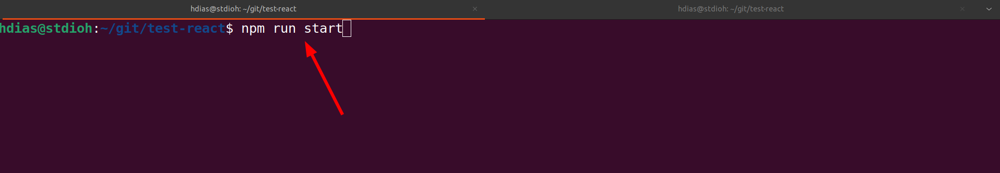
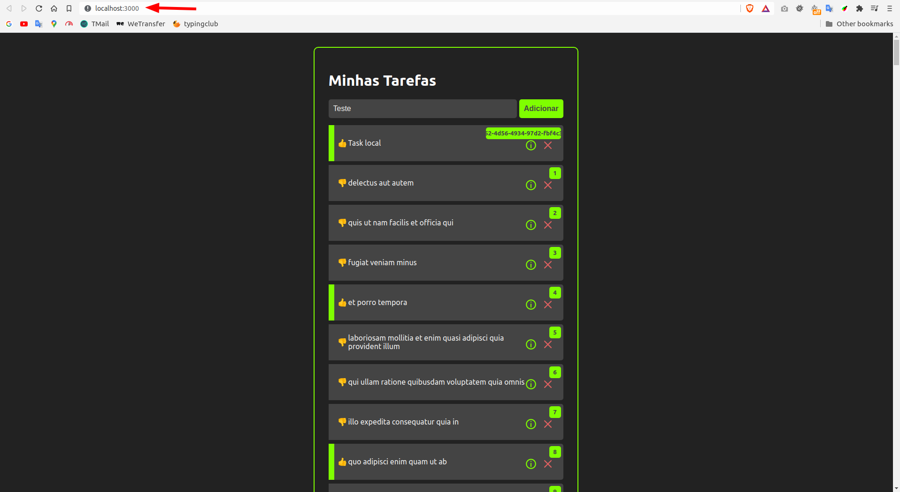

# Todo with React
A todo application with **react >= 17**

# DEMO
## **https://test-react-todo.netlify.app**
# Requirements
* [Node/NPM](https://nodejs.org/pt-br/download/)

# Setup
```sh
git clone https://github.com/stdioh321/test-react.git
npm install
```

# Run
```sh
npm run start
```


Open your browser at:

**http://localhost:3000**


|Index|Details|
:---:|:-----:
|


# References
* [Youtube Tutorial](https://www.youtube.com/watch?v=ErjWNvP6mko)
* [React Hook](https://pt-br.reactjs.org/docs/hooks-overview.html)